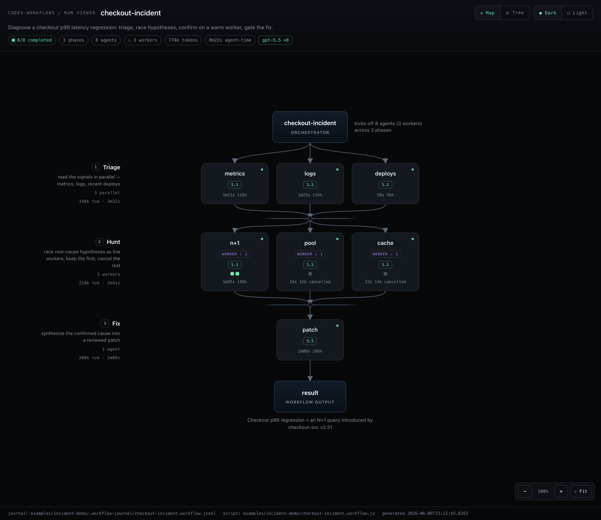
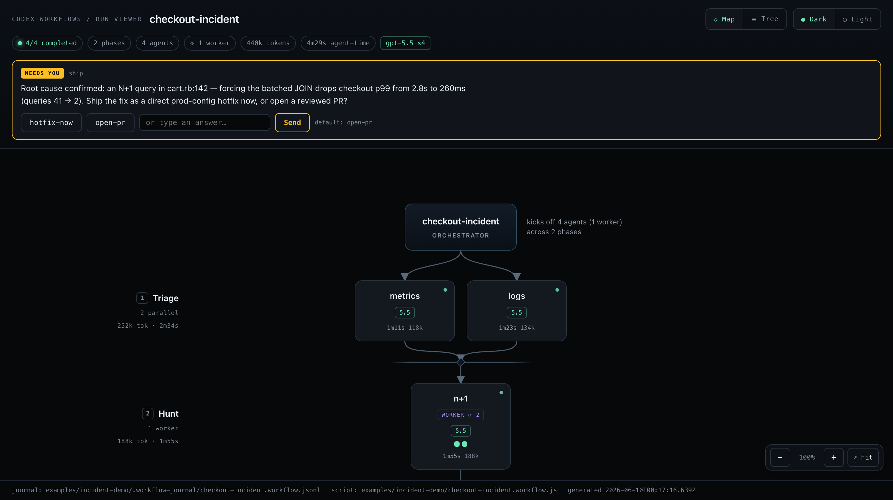
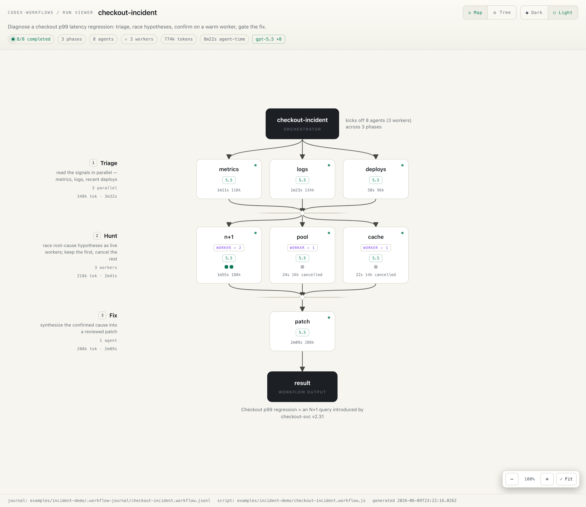
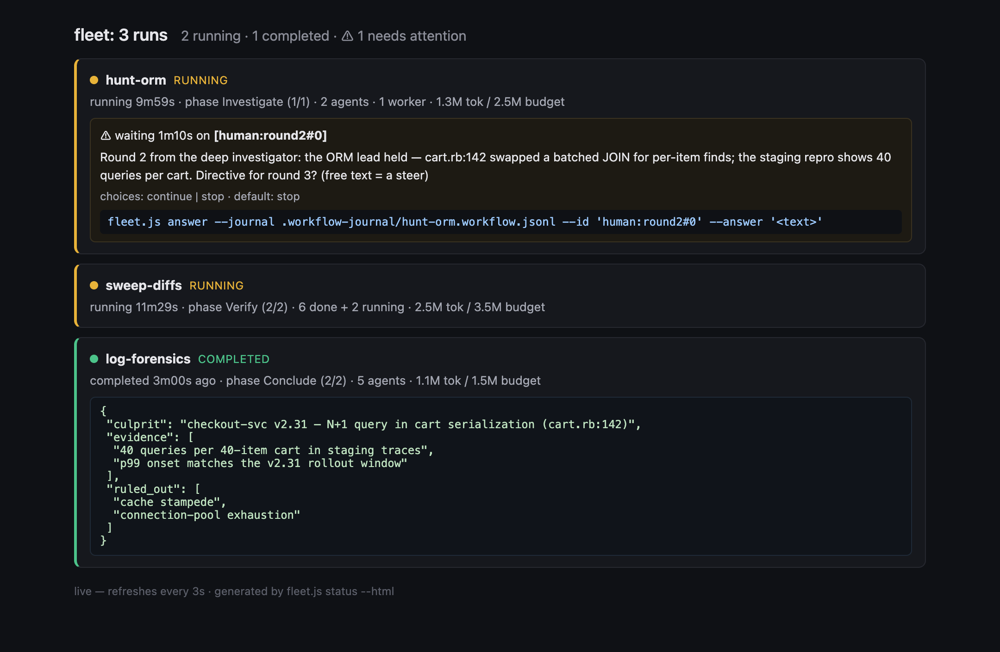
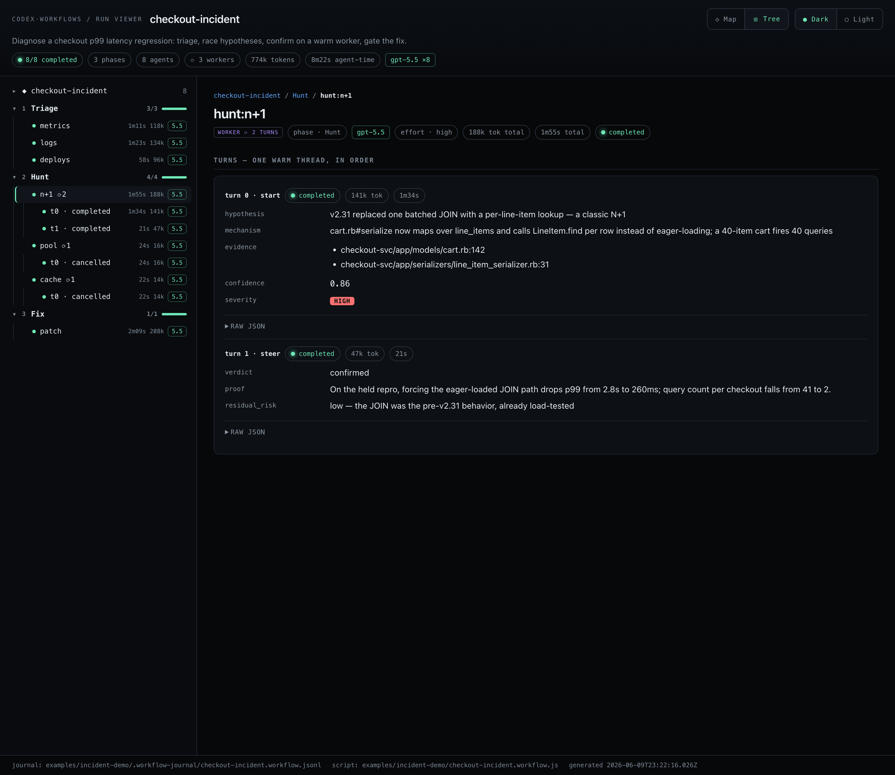

# Claude Dynamic Workflows — on Kimi

> A **Claude Code plugin**: invoke `/kimi-workflows` and a fleet of **Kimi agents**
> fans out across the work — Claude authors the workflow, runs it via headless
> `kimi -p` prompts, and streams it back as a live **execution map**.

[](LICENSE)


[](https://github.com/da-moon/claude-dynamic-workflows-kimi/actions/workflows/ci.yml)



<sub>↑ a real run: diagnose a checkout latency regression — triage the signals in parallel, **race three root-cause workers** and cancel the losers, steer the winner on its warm transcript, then gate the fix. This is the bundled demo; open it yourself in 10 seconds ([below ↓](#see-it-now-no-kimi-required)).</sub>

You describe a task; **Claude Code** writes a [dynamic-workflow](https://code.claude.com/docs/en/workflows) script — `agent()` / `parallel()` / `pipeline()` / `phase()` / `budget` — and runs it across dozens of Kimi agents. The runtime holds the loop, branching, and intermediate results, so your context only sees the final answer — and you watch it build as an interactive map. And unlike the native one-shot DSL, workers here can stay **live** — steer a worker on warm context, race several and cancel the losers, or let a controller adapt the plan as results land ([Beyond one-shot ↓](#beyond-one-shot-sessionful-workers)). It scales one level up, too: add **`--multi`** and Claude launches a whole **fleet of concurrent workflows and supervises them itself** — answering their gates, steering, killing dead ends, forking winners ([walkthrough 8 ↓](#8--run-a-whole-fleet--and-let-claude-supervise-it)). Great for codebase audits, large migrations, cross-checked research, and idea generation.

This repo is **two ways in**:

1. **The `kimi-workflows` skill** — how you use it day to day, from Claude Code. **Start here ↓**
2. **A standalone runner + viewer** — the same engine without the skill (a CLI, [near the end](#without-claude-code-standalone-cli)).

> Unofficial / community project. Not affiliated with Moonshot AI or Anthropic.
> "Kimi", "Claude" and "Claude Code" are trademarks of their respective owners.

---

## See it now (no Kimi required)

Want a look at a finished run before installing anything? The viewer is offline and self-contained, and the flagship demo is bundled:

```bash
git clone https://github.com/da-moon/claude-dynamic-workflows-kimi
cd claude-dynamic-workflows-kimi
node runner/bin/view-run.js examples/incident-demo --open
```

That opens the map above — a fictional **checkout-latency incident**: a parallel triage, a **race of three sessionful root-cause workers** (the winner is steered for a confirming second turn; the two losers are cancelled, marked ⊘), and a lone fix gate. Click any node for its full result; click the **n+1 worker** to see its per-turn timeline; **F** frames the graph, drag to pan, scroll to zoom.

|  |  |
| :--- | :--- |
| **Map — the run as a DAG.** Workers carry a `⟳ N` badge and a turn-chip strip. | **Worker timeline.** Click a worker → every turn on its one warm thread. |
|  |  |
| **Cockpit.** A live run paused at a `human()` gate — answer it right in the page. | **Light theme.** Toggle Dark/Light top-right; there's a dense **Tree** layout too ([below](#the-run-viewer)). |
|  |  |

The first thing you'll notice is what's *not* in the old one-shot model: **long-lived workers** (`⟳ 2 turns`), a **race** that cancelled its losers, and — live — an **answer card** the run is waiting on. The rest of this guide is how to *drive* all of that from Claude Code.

---

## Install

**As a Claude Code plugin** (recommended — updates with every push):

```text
/plugin marketplace add da-moon/claude-dynamic-workflows-kimi
/plugin install kimi-workflows@kimi-workflows
```

Then run `/reload-plugins` (or restart Claude Code) to activate it. The
non-interactive shell equivalent:

```bash
claude plugin marketplace add da-moon/claude-dynamic-workflows-kimi && \
  claude plugin install kimi-workflows@kimi-workflows
```

**Or as a classic skills-dir clone:**

```bash
git clone https://github.com/da-moon/claude-dynamic-workflows-kimi ~/.claude/skills/kimi-workflows
```

The clone auto-loads on the next session as the plugin
`kimi-workflows@skills-dir` — the same `/kimi-workflows` skill as the
marketplace install, no install step.

(Developing from a clone elsewhere? `npm run sync-skill` pushes the skill
surface — `SKILL.md`, `.claude-plugin/`, `bin/`, `references/`, `examples/`,
`runner/` — to `~/.claude/skills/kimi-workflows` in one command; it refuses to
run when the destination is the repo itself.)

**Prerequisites**

- [Node](https://nodejs.org) ≥ 18.17 (zero npm dependencies to install; CI-tested on Node 20 and 24)
- The [`kimi`](https://code.kimi.com) CLI on your `PATH`, logged in: `kimi login`

Either way the plugin is now available in Claude Code.
Verify Kimi is reachable any time with:

```bash
npx github:da-moon/claude-dynamic-workflows-kimi doctor   # → state: ready
```

(The same `npx` entrypoint exposes the whole CLI surface without installing
anything: `run`, `fleet status|answer`, `supervise`, `view`, `map`,
`summarize`, `compare`, `doctor`.)

---

## Using it in Claude Code

Claude can **auto-invoke** the skill when you ask for multi-agent Kimi orchestration — a Kimi fan-out, a fleet of Kimi agents, "run this as a Kimi workflow" — and `/kimi-workflows` always invokes it explicitly. Either way, describe the task in **one or two rough sentences** — there's no need to pre-engineer a prompt; the skill compiles your rough intent into the right workflow itself:

```text
/kimi-workflows  Audit every route under src/ for missing auth checks
```

Behind that one line, Kimi:

1. **Preflights** Kimi CLI — confirms it is reachable and notes the latest frontier model.
2. **Compiles** your rough intent into a concrete harness — picks the scale, archetype, and pattern, builds a task contract, and states its assumptions (no external "metaprompt" needed).
3. **Authors** a workflow script into your project (`./<name>.workflow.js`) — so you can read it, tweak it, and rerun it.
4. **Runs** it via Kimi CLI, pinning **every agent to the latest frontier model** and **scaling reasoning effort to the harness** — a small run goes flat `--effort low`, while a bigger one uses `--auto-effort` so a lone judge/synthesize gate gets the policy's top tier (`max`) and wide fan-outs floor at `high`.
5. **Surfaces** the outcome right in the conversation — a summary, the script path, and the run's **execution map rendered inline** as text:

```text
╭─ ◆ market-news ──────────────────────────────────────────────────────────────╮
│ ✓✓✓✓✓✓  6/6 done · 2 phases · 701k tok · 20m27s · kimi-code/k3               │
╰──────────────────────────────────────────────────────────────────────────────╯
  │
  ▼ ① Gather ───────────────────────────────────  5 agents · 622k tok · 17m38s
      AGENT      MODEL    EFFORT  TOKENS    WALL
  ├─✓ indices    k3       high       52k   1m26s
  │   S&P 500 rose 0.4% to a record 6,012; Nasdaq +0.6% and Dow +0.3% close.
  ├─✓ movers     k3       high      140k   5m16s
  │   Nvidia gained ~3% on AI demand; a major retailer slid 8% on guidance.
  ╰─✓ catalysts  k3       high      128k   3m27s
      Several megacap earnings beat after the bell; Fed stayed data-dependent.
  ┄ barrier · Gather → Synthesize ┄┄┄┄┄┄┄┄┄┄┄┄┄┄┄┄┄┄┄┄┄┄┄┄┄┄┄┄┄┄┄┄┄┄┄┄┄┄┄┄┄┄┄┄┄┄┄
  ▼ ② Synthesize ──────────────────────────────────  1 agent · 79k tok · 2m49s
  ╰─✓ brief      k3       max        79k   2m49s
      Fed, jobs and AI earnings kept stocks near records into June 3.
  │
  ▼
╭─ ✦ result ───────────────────────────────────────────────────────────────────╮
│ Fed, jobs and AI earnings kept stocks near records into the June 3 close.    │
╰──────────────────────────────────────────────────────────────────────────────╯
```

The captured output above is a sample run (model chips as recorded). The skill
deliberately does not route stages across model tiers: `--frontier` picks the
strongest model
**configured in your kimi CLI** (`kimi provider list` — e.g.
`kimi-code/k3`, the max-only frontier tier) and pins the whole run to that one model.

### Steering your run — just ask

You don't manage flags; you describe what you want and Claude wires it up. Common asks:

| You want to… | Say something like… | What Claude does |
| :--- | :--- | :--- |
| **Watch it build live** | "…and let me watch it" · "open the live GUI" | opens a browser viewer (`--gui`) and/or a new-terminal ASCII map (`--tui`) that update **in place** as agents run |
| **See the size/cost first** | "plan it first — how many agents, roughly how much?" | a **no-token dry run** (`--plan`) that counts agents per phase and estimates a budget |
| **Cap the spend** | "keep it under ~5M tokens" | a hard `--budget` ceiling — tripping it isn't fatal, it prints a one-line `--resume` to continue |
| **Keep it read-only (safety)** | "read-only — don't let agents write files" | runs with `--sandbox read-only`, which is **enforced** (best-effort): every agent gets a disposable worktree cwd — stray writes never touch your checkout and are discarded — plus a hard read-only preamble. Refused fast if the isolation is unavailable. Not a security boundary: absolute paths/shell/network can still escape ([Safety](#safety)) |
| **Let it edit files** | "let it apply the migration" | nothing to unlock — agents already run **full-auto** (read/write/shell, no prompting), the first-class default; the run can be labeled `--sandbox workspace-write` so the intent is recorded (advisory — behavior unchanged) |
| **Resume after a stop** | "resume that run" | replays already-finished agents from the journal **free**, runs only the rest; sessionful workers re-attach to their persisted threads **warm** |
| **Be asked before risky steps** | "check with me before applying anything" | authors a `human()` gate — the live viewer shows an **answer card** (choices + free text) right in the run page; the run waits there, fleet warm, and falls back to a safe default on timeout |
| **Pick a specific pattern** | "do a loop-until-dry bug hunt" · "fresh-context review with independent reviewers" | authors that exact pattern (see the [pattern library](references/authoring.md)) |
| **Run a supervised fleet** | "`--multi`" · "throw a few different harnesses at this at once" | launches 2–4 concurrent variant workflows in the background and **supervises them itself** — polls `fleet status`, answers their gates, steers, kills dead ends, forks winners, then synthesizes across runs (see walkthrough 8) |

One thing you *don't* tune: it's always **one frontier model for every agent** — no model-mixing. Reasoning **effort** scales to the harness instead (a quick 2–5-agent run goes flat `--effort low`; bigger runs use `--auto-effort`, so lone judge/synthesis gates think hardest). **To spend less**, lower the **budget**, drop the **effort**, narrow the **fan-out**, and **`--plan` first** to size it — never a smaller model. (Read-only is a **containment** setting — agents run cwd-isolated so writes can't dirty your tree — not a cost lever; see [Safety](#safety).)

### Example invocations

```
# Audit — scan in parallel, then a skeptic confirms each finding
/kimi-workflows  Audit every route under src/ for missing authorization, read-only

# Research — fan out across the web, cross-check every claim, cite the survivors
/kimi-workflows  Research the current state of on-device LLM inference and verify each claim, then watch it live

# Brainstorm — generate, dedup, judge, recommend (plan it first to see the cost)
/kimi-workflows  Brainstorm 10 product ideas from this repo, score them with 3 judges, recommend the top 3 — plan it first

# Review — producer drafts, independent reviewers sign off (no agent reviews its own work)
/kimi-workflows  Review the files I changed for bugs with a fresh-context review gate

# Triage — classify a batch in parallel, dedupe, route (untrusted text stays read-only)
/kimi-workflows  Triage these 40 issues and route each to a team

# Migrate — find every call site and rewrite it (needs write access)
/kimi-workflows  Find every call of legacyFetch() and migrate it to the new client, then apply the edits

# Harden a goal — lint a vague /goal into a precise, testable one before you spend a fleet (goal_lint)
/kimi-workflows  Harden this Kimi goal before I run it

# Claim-check — verify a draft's claims against the actual repo, refute the unsupported ones (claim_check)
/kimi-workflows  Verify this blog draft against the repo

# Invent — net-new-to-industry product ideas, not thin wrappers; judged and recombined (industry_invention_studio)
/kimi-workflows  Generate practically useful, net-new product ideas from this repo

# Triage a result — decide real / overfit / continue, then write the next experiment's /goal (research_result_triage)
/kimi-workflows  Triage the latest research result and write the next /goal

# Fleet — several concurrent workflows, supervised by Claude (answers gates, steers, kills, forks)
/kimi-workflows --multi  Find the cause of the checkout p99 regression — attack it from a few different angles at once
```

Rough intent is the default — a sentence or two is enough, and the skill compiles the rest (scale, archetype, pattern, task contract, safe run settings). Add `prompt-only` if you just want the generated invocation without running it.

### Following a run

- Claude renders the **execution map inline** as the run progresses and again when it lands — so you can follow it without leaving the conversation.
- For the full browser GUI at any time, just ask Claude to **open the viewer** (it runs `view-run` on the run's journal).
- For a **cost & reliability recap** — tokens by phase, the costliest/slowest agents, and any red flags — ask Claude to **summarize the run** (it runs `summarize-run` on the journal); a short version also prints automatically when a run finishes.
- To see **across runs** — what each run cost, completion rates, and how the same workflow trends run-over-run — ask Claude to **compare the runs** (it runs `compare-runs` over the journals; one line per run plus per-workflow rollups like "avg 1.2M tok/run · latest vs prev: −20%").
- Every run is journaled to `<project>/.workflow-journal/<name>.jsonl`; ask Claude to **open the last run in the viewer** to revisit a past run.
- The script Claude wrote stays in your project — rerun or edit it directly, or ask Claude to adjust it.

> **Not what you wanted?** If you actually want **Claude** subagents (not Kimi), use Claude Code's native Workflow tool instead — this skill deliberately routes the work to Kimi.

---

## Real-world walkthroughs

Each of these is **one rough sentence** to `/kimi-workflows`. Claude compiles it into the harness described, runs it on Kimi, and hands you the artifact — you watch it build the whole time. These are the shapes people actually reach for.

### 1 · Diagnose a production incident (the bundled demo)

> `/kimi-workflows  Checkout p99 just spiked 12×. Triage the signals, race a few root-cause theories, confirm the leading one, and propose a fix — read-only, and ask me before you suggest shipping anything.`

Claude authors a **root-cause lab**: a parallel **Triage** (metrics · logs · recent deploys), then a **Hunt** that *races three live workers* — one per hypothesis (N+1 query, pool exhaustion, cache stampede). The first to land wins; the runtime **cancels the other two** (you don't pay for the slowest). The winning worker is then **steered on its warm thread** — "confirm on the held repro" — a cheap second turn that doesn't re-read anything (141k tokens for the hunt → 47k for the confirmation). It **pauses at a `human()` gate** for the ship decision, then a lone `max` synthesizer writes the patch + a regression test. The whole run is the hero image above; click the **n+1** worker for the per-turn timeline, and the live run shows the **answer card** (the cockpit screenshot). Bundled — open it with `node runner/bin/view-run.js examples/incident-demo --open`.

### 2 · Audit a codebase for a class of bug — and trust the result

> `/kimi-workflows  Audit every route under src/ for missing authorization, read-only. Have an independent skeptic try to refute each finding before you report it.`

The classic **find → adversarially-verify** shape, and the reason to use a fleet instead of one agent: one pass *finds* candidates in parallel (one agent per area), then a **second, independent agent tries to refute each** — defaulting to "not a real finding" unless it can prove exploitability with a `file:line`. Plausible-but-wrong findings die in verification instead of in your inbox. You get a deduped table of *confirmed* issues with evidence, and with `--sandbox read-only` every agent runs mechanically contained — a disposable worktree cwd plus a hard read-only preamble, so stray writes never reach your checkout (best-effort; see [Safety](#safety)). Swap "authorization" for "missing input validation", "unhandled promise rejections", "N+1 queries", "PII in logs" — same harness.

### 3 · Load a big thing once, then interrogate it cheaply

> `/kimi-workflows  Read everything under packages/core into one worker, then I'm going to ask it a stream of questions — keep it warm.`

This is the **sessionful** superpower the native one-shot DSL can't do. One worker ingests the corpus **once** (`agent.start`); every follow-up is a `session.steer` on the *same warm thread* — it answers from context instead of re-reading. Measured on this repo's own source (kimi-code 0.23.3): after the one-time load, each follow-up ran **~1.6× cheaper in (estimated) tokens and ~1.8× faster per turn** than a cold re-read, with the warm arm's cumulative tokens ahead by the second question ([benchmark + measurement caveats](examples/benchmarks)). Works for a data room, a contract set, a spec bundle, a log archive — anything you'll question more than twice.

### 4 · Throw several strategies at one stubborn bug

> `/kimi-workflows  This flaky test fails ~1 in 20. Try three theories at once — a recent regression, a timing/ordering race, and a shared-state leak — and tell me whichever one cracks it first.`

A **hedged race**: three workers attack the same problem from different angles in parallel; `agent.waitAny` wakes you on the **first** to reach a conclusion, and the losers are **cancelled** on the spot. You stop paying for the two dead ends the moment the live one pays off — the opposite of a `parallel()` barrier that waits for (and bills) the slowest. Reach for it whenever the *cheapest path to an answer is unknown* and trying several beats committing to one.

### 5 · Let it do the work — but stop at the decisions only you should make

> `/kimi-workflows  Migrate every call of legacyFetch() to the new client and apply the edits — but show me the plan and check with me before you touch anything in payments/.`

The **cockpit**. Claude authors a migration that discovers every call site, drafts the rewrites, and at the risky fork calls `human("apply to payments/ now, or open a PR?", {choices})`. With `--gui`, the run **pauses and an answer card appears right in the live viewer** (the cockpit screenshot) — the whole fleet stays *warm* while it waits for your click. Unattended (CI, overnight) it falls back to the safe default after a timeout instead of hanging, and your answer is journaled so a `--resume` never re-asks. Supervised autonomy: the agents do the labor, you keep the judgment calls.

### 6 · The trust loop — harden the instruction before, verify the claims after

> Before: `/kimi-workflows quick Harden this Kimi /goal before I run it: [paste]`  ·  After: `/kimi-workflows Verify this PR description's claims against the actual diff and repo.`

Two shipped harness-zoo templates that bracket any expensive run. **GoalLint** turns a vague, risky `/goal` into a precise, **falsifiable**, artifact-producing one — so you stop getting runs that end in "looks good" with no controls and no stopping criteria. **ClaimCheck** extracts every factual claim in a doc (README, PR, report, agent output), verifies each against repo artifacts, marks them *supported / unsupported / contradicted / plausible-unverified*, and emits a **proof ledger** with safer rewrites for the ones that don't hold. *Harden before agents run; verify the claims after they write.*

### 7 · Cross-checked research with source discipline

> `/kimi-workflows  Research the current state of on-device LLM inference, verify every claim against a source, and cite the survivors — watch it live.`

A research fan-out that's honest about what it knows: parallel searches gather candidate claims, an independent pass **verifies each against a real source** (and *reports gaps rather than fabricating* when the evidence isn't there), and a synthesizer writes the cited brief. Confirmed evidence, inference, and uncertainty stay separated — missing evidence is treated as uncertainty, not success.

### 8 · Run a whole fleet — and let Claude supervise it

> `/kimi-workflows --multi  Find the cause of the checkout p99 regression — attack it from a few different angles at once, and keep the total under 5M tokens.`

With `--multi`, Claude stops being a launcher and becomes the **operator**. It compiles a *fleet plan* — say, a sessionful deep-dive on the ORM theory, a loop-until-dry sweep of recent diffs, and a log-forensics fan-out — and launches each as its own background run in one shared directory, budget split across them. Then it runs the supervision loop the runner was built for: `fleet status` rolls every run into one digest (who's running, who's **stalled**, who's **waiting on an answer**, who finished and what they returned), gates **push** instead of waiting to be polled (`--notify-cmd` fires a shell hook the moment a question goes pending or a run ends), and the workflows are authored with **supervisor checkpoints** — `human()` gates whose answers Claude itself supplies via `fleet answer`, with free text acting as a *steer* ("drop the cache theory, go deep on the ORM layer"). A run chasing a dead end gets killed and its tokens stop; a run onto something big gets **forked** — copy the journal, extend the variant, `--resume` replays everything already done at **0 tokens** and sessionful workers re-attach to their threads warm. At the end Claude reconciles the variants' results — including what the killed runs ruled out — into one answer with per-variant costs.



<sub>↑ the live fleet dashboard mid-supervision: the deep investigator is **waiting on a steer** (free text = a directive, with the paste-ready answer command right under it), the diff sweep is mid-verify, and log-forensics has already returned its verdict.</sub>

You're never locked out of the loop: the same checkpoints stay human-answerable in the `--gui` cockpit, and `fleet status --watch --html fleet.html --open` gives you a **live fleet dashboard** (above) — one card per run, auto-refreshing, with paste-ready answer commands under every pending gate. The difference is you no longer *have* to be there. ([examples/fleet](examples/fleet) is the runnable two-variant version with the full transcript.)

And the supervision layer isn't limited to workflows — it's a documented **file contract** ([fleet-protocol.md](references/fleet-protocol.md)), and the bundled `supervise` shim wraps **any long-running command** in it:

```bash
npx github:da-moon/claude-dynamic-workflows-kimi supervise --name nightly -- python run_evals.py
```

The job appears in `fleet status` and the dashboard like any run, its output streams as live progress, and a one-line `@@ASK {"question":"Promote?","choices":["yes","no"],"default":"no"}` printed by the job becomes a real supervisor gate — the answer lands on the job's stdin (`read answer` in bash), with the safe default on timeout. Your deploy script, eval run, or data job gets the same supervised-autonomy treatment as a workflow fleet.

This isn't hypothetical — this repo dogfoods it. A `--multi` fleet was pointed at its own docs before this README shipped: two variants checked 90 documentation claims and walked the fresh-user install story, adversarially verified their own findings (8 flagged → 6 survived the refuters), and every confirmed issue was fixed — including one of them becoming a permanent CI suite.

> **Sizing & cost.** Unsure how big a run will be? Add **"plan it first"** — a no-token dry run prints the agent count per phase and a budget estimate before you spend anything. Add **"keep it under ~5M tokens"** for a hard ceiling (tripping it is recoverable — it prints a free `--resume`). To spend less: lower the budget, drop the effort, narrow the fan-out — never a smaller model (it's always one frontier model for every agent).

---

## The run viewer

Whether Claude opens it (`--gui` / "open the viewer") or you generate it yourself, you get one **self-contained HTML file** — works offline, shareable, no server. Two layouts (toggle top-right), a **Dark / Light** theme, and per-agent **tokens, time, model, and effort** at agent, phase, and run level.

- **◇ Map** — orchestrator → one row of parallel agents per phase → barrier merges → **result**. Each node carries its model / time / tokens; it opens at a readable 100% (**F** = fit the whole graph, `0` = reset, scroll zooms toward the cursor, drag pans). Wide fan-outs fold into an **aggregate node** you expand inline (running agents and workers are never hidden); not-yet-started phases show a "pending" placeholder. Click any node — or the **result** node — for an **inspector that docks beside the graph** (the map stays visible) with the full structured result. A **sessionful worker** is a single node with a `⟳ N` turn-chip strip; open it and the inspector shows its **per-turn timeline** — every steer on the worker's one warm thread, in order, with each turn's own tokens and time (the worker-timeline screenshot above). Cancelled race losers are marked ⊘.
- **☰ Tree** — a dense `Run → Phase → Agent / Worker` inspector: phase **progress bars** with inline per-agent time / tokens / model, workers expand to their nested turns, and the run's actual **returned value** sits at the top.



Results render generically (arrays-of-objects → tables, `palette` → swatches, `severity`/`effort` → badges, 1–10 → score pills, raw-JSON toggle), and it's fully **keyboard-navigable** (Tab / Enter / arrows / Esc) with `prefers-reduced-motion` support.

**Live, in place — no reload.** With `--gui`/`--watch` the viewer is a live monitor that patches the DOM **without ever reloading**: running agents are amber with a ticking clock and **stream their partial output in the drawer**, finished agents flip to their result, and a status strip tracks wall-clock / last-update age / running count. Your view is never yanked — theme, layout, the open inspector, scroll, and zoom all survive every update; an inspector left open on a still-running agent (or a worker mid-steer) fills in *in place* the moment its result lands. When the run finishes it settles into the static, shareable artifact. (It stays a single file: the live channel uses tiny sidecars pulled via a script tag, not `fetch`, so it updates live even opened as a `file://`.)

**The cockpit — answer a `human()` gate in the page.** When a workflow reaches a fork only you should decide, it pauses and a **"needs you" answer card** appears at the top of the live viewer — choice buttons plus a free-text box (the cockpit screenshot above) — and the run waits, fleet warm, for your click. With `--gui` the page is served on `127.0.0.1` so the card posts your answer straight back to the running workflow; opened as a bare `file://` it shows the one-line terminal command to answer instead. Unattended runs fall back to the gate's default after a timeout — it never hangs.

**Watching many runs at once — the fleet dashboard.** The viewer above is one run deep; a [`--multi` fleet](#8--run-a-whole-fleet--and-let-claude-supervise-it) is several runs wide. `fleet status <dir> --watch --html fleet.html --open` writes a **live card-per-run dashboard** — state, phase and agent progress, tokens vs budget, every pending gate with a paste-ready answer command, each finished run's result, and a link into that run's full viewer — auto-refreshing while anything is live, settling static when the fleet is done. The same `fleet status` in a terminal (or `--json` for an agent) is the supervision surface Claude itself polls.

Prefer the terminal? The same run renders as the **ASCII map** shown above — that's exactly what Claude pastes inline, and it has a live `--watch` too.

---

## Putting it to work

`/kimi-workflows` is most useful as an **operating layer around your agents** — reach for it *before* expensive work, *after* messy results, and whenever you want a **repeatable process** instead of a one-off answer. Today **GoalLint** and **`summarize-run`** are concrete and shipped; the other archetypes (triage, eureka, repo-deep-read, root-cause, rule-mining, …) are **shapes the skill authors on demand** — promote the ones that earn their keep into `examples/harness-zoo/` (see the last pattern below).

### Harden the goal before an expensive run

Make this the default reflex. Before handing a serious `/goal` to Kimi — especially anything touching research claims, benchmarks, repo edits, evals, or "is this result real?":

```text
/kimi-workflows quick Harden this Kimi goal before I run it:
[paste your /goal]
```

GoalLint turns a vague, risky instruction into a precise, testable, **falsifiable**, artifact-producing one — so you stop getting runs that end in "looks good" with no artifacts, no controls, and no stopping criteria.

### Inspect every nontrivial run

Treat the run summary as an **agent-ops dashboard**, not an afterthought (full flags in [The run summary report](#the-run-summary-report)):

```bash
node runner/bin/summarize-run.js <run-dir> --list          # list a dir's journals, newest first
node runner/bin/summarize-run.js <run-dir> --markdown --out reports/<name>-summary.md
```

It tells you what the run cost, which phases were expensive, which agents were slow or returned null, whether a resume replayed cached work, and it flags structural smells (a huge single-phase fan-out, agents left on default effort). On resumed runs it separates the journal's **all-in** tokens from the **latest run's executed** tokens. If a workflow is expensive or messy, fix the **harness**, not just the prompt.

### A research loop: triage → ideate → harden → execute → inspect

For experiment-driven work, run a cadence instead of one-off prompts:

```text
# after a result lands — decide what it means and what's next
/kimi-workflows Triage the latest result in this repo. Decide whether it's real, overfit, useful, or worth continuing, then write the next strict Kimi /goal.

# when you're stuck or a result is ambiguous — generate testable directions
/kimi-workflows deep Generate surprising but practically testable next research ideas from the latest reports and logs. Emphasize hidden mechanisms, falsification, and hard-to-fake success criteria.
```

Then GoalLint the chosen `/goal`, run it on Kimi, and `summarize-run` the result — and repeat.

### Reach for quick harnesses daily

This isn't only for giant fan-outs. A `quick_harness` is **2–5 agents** for goal hardening, assumption checks, small critiques, quick ranking, or a single claim check — cheap enough for everyday use:

```text
/kimi-workflows quick Critique this plan before I send it to Kimi — ambiguity, falsification, and overbuild critics only.
/kimi-workflows quick Rank these 6 ideas by novelty, practical usefulness, and fastest proof-of-value — pairwise, not 1–10.
/kimi-workflows quick Check whether this README claim is actually supported by the current repo.
```

### Ask what harness a task deserves

When you're unsure whether a task wants goal-hardening, claim verification, loop-until-dry, tournament ranking, a root-cause lab, or bounded execution, let the skill **design the harness** without running it:

```text
/kimi-workflows prompt-only Design the best Kimi-backed harness for: [rough task]. Choose the scale, archetype, pattern, failure mode, task contract, phases, personas, run settings, and output artifacts. Don't run it.
```

### Diagnose failures with a root-cause lab

When CI, a run, a benchmark, or a Kimi task fails, don't ask one agent to "fix the bug" — that invites a confident wrong diagnosis:

```text
/kimi-workflows Diagnose the latest failed run. Use a root-cause lab: separate agents for logs, recent diffs, code-path tracing, environment/resource issues, hypothesis generation, hypothesis refutation, and a minimal repro. Return ranked causes and the cheapest discriminating next test.
```

### Turn recurring failures into durable rules

Periodically mine your own traces so the system gets better as you use it:

```text
/kimi-workflows Mine recent reports, journals, failed agent outputs, and my corrections for recurring failure modes. Propose durable rules for CLAUDE.md / AGENTS.md / harness templates — keep only rules that would have prevented a real failure without over-constraining future work.
```

### Structured synthesis with source discipline

The tool isn't only for code. For a memo, brief, or grant concept, the `policy_or_grant_builder` archetype runs an evidence scan, an opposition critique, claim verification, and a concision pass:

```text
/kimi-workflows Draft a one-page memo from the files in this folder — evidence scan, opposition critique, claim verification, then a ruthless concision edit.
```

When a task needs current facts the repo doesn't contain, tell it to **report source gaps rather than fabricate** — the skill's epistemic standards already separate confirmed evidence from inference and treat missing evidence as uncertainty, not success.

### The trust loop: harden before, verify after

GoalLint is the **before** tool. Its natural **after** counterpart is **ClaimCheck** — extract the claims in a README, post, report, or agent output, verify each against repo artifacts, and emit a proof ledger. The skill can author it as a reusable template:

```text
/kimi-workflows Create a reusable harness-zoo workflow `claim-check.workflow.js`: extract claims from a doc or agent output, verify each against repo artifacts, mark them supported / unsupported / contradicted / plausible-unverified, suggest safer rewrites, and emit a proof ledger. Include a README, sample args, and a plan-mode smoke test.
```

> **Harden the instruction before agents run; verify the claims after they write.** Together that's a trust loop.

### Promote what repeats into a template

When a rough-intent workflow earns its keep over a few runs, productize it so next time it's one command:

```text
Run a rough-intent workflow 3–5 times → notice repeated value →
promote it to examples/harness-zoo/<name>/ with a README, sample args, and a --plan smoke test.
```

GoalLint already proves the model (workflow + README + sample args + strict schemas + a `--plan` test). Strong next candidates: `claim-check`, `research-result-triage`, `root-cause-lab`, `agent-rule-miner`.

### A weekly cadence

```text
Before each expensive run   →  /kimi-workflows quick Harden this /goal before I run it.
After each result           →  /kimi-workflows Triage the latest result and write the next /goal.
After each run              →  summarize-run the journal; fix the harness if it's costly or messy.
Weekly                      →  /kimi-workflows Generate net-new practical ideas from this repo and recent run summaries.
Monthly                     →  /kimi-workflows Mine recurring agent failures into durable rules.
```

---

## Beyond one-shot: sessionful workers

The native dynamic-workflows DSL gives you **one-shot** agents: `agent()` runs once and returns; `parallel()` waits for all of them. This re-host keeps all of that, faithfully — and adds the part the native DSL doesn't have: **long-lived workers you can steer, race, and cancel.** This is what most separates the project from the native feature.

> `agent()` returns an *answer*. `agent.start()` returns a *worker* — one you can talk to again on warm context, race against its siblings, and steer mid-task.

|  | Native dynamic workflows | This re-host |
| :--- | :--- | :--- |
| Fan out + wait | `agent()` · `parallel()` | **same** — faithful re-host |
| **Stateful** — ask a warm worker again | a new `agent()` is a cold thread; re-reads from scratch | `agent.start` + `session.steer` — same thread, keeps full context |
| **Reactive** — first-to-finish, cancel the rest | `parallel()` barrier — waits for the slowest, pays for all | `agent.waitAny` + `session.cancel` |
| **Adaptive** — rewrite the plan mid-run | a DAG fixed at author time | a controller agent: accept / steer / spawn / cancel / stop |

The top row is the honest part: the shared DSL behaves exactly as documented; the rest is purely additive.

**See it in the viewer.** The hero map's **Hunt** phase *is* this: three workers racing, the winner steered for a confirming second turn, the two losers cancelled (⊘). Click the `n+1` worker and the inspector shows its **per-turn timeline** (the worker-timeline screenshot above) — turn 0 the hunt, turn 1 the warm steer, billed separately (141k → 47k). And a run paused at a `human()` fork shows the **cockpit answer card** (the cockpit screenshot). All bundled: `node runner/bin/view-run.js examples/incident-demo --open`.

```js
// race two approaches, act on whichever lands first, then keep questioning it — warm
const a = await agent.start("Find the cause working backward from the symptom.", { sandbox: "read-only" });
const b = await agent.start("Find the cause assuming a recent regression.",      { sandbox: "read-only" });
const first = await agent.waitAny([a, b]);                          // wake on the first to finish
await first.session.steer("Now give me the exact fix.", { wait: true }); // same thread, keeps context
for (const s of first.pendingSessions) await s.cancel();           // stop the losers
```

**Why you'd reach for it**

- **Load once, ask many** — drop a huge repo / data-room into one worker, then `steer` a stream of follow-ups cheaply, instead of re-reading it on every question.
- **Race and cut losers** — fire several strategies at one problem, keep the first that works, cancel the rest.
- **Follow the evidence** — a controller agent chases the strongest lead instead of a question list frozen at author time.

**Measured, not asserted** ([`examples/benchmarks/`](examples/benchmarks)): on the current Kimi backend (kimi-code 0.23.3, at the then-current `medium` effort), a warm worker answered each follow-up **~1.6× cheaper in (estimated) tokens and ~1.8× faster per turn** than cold one-shots, cumulative tokens ahead by the second question.

**Runnable examples** (all `--plan`-safe — dry-run any with `--plan`, no Kimi, no tokens):
`sessionful-workers` (the intro) · `warm-context-interrogation` (load once, ask many) · `hedged-take-first-win` (race + cancel) · `flaky-bug-perturbation` (hold a repro, perturb it) · `lead-following-research` (controller chases leads) · `stateful-dialogue` (memory vs. a cold judge) · `agent-foreman` (supervised autonomy, escalate at forks) · `human-gate` (pause at a declared fork, answer in the live viewer, steer the warm worker).

> **Resume (honest):** one-shot `agent()` is resumable as always. Sessions resume **warm**: a `--resume` replays the already-completed turns free from the journal and re-attaches each worker to its persisted Kimi session (`kimi -S <session id>`), so new steers run on the worker's full prior context — tool calls included. If the persisted session is gone, the worker's next turn falls back to a fresh session rebuilt from its journaled transcript (correct, just not free), and journals from older runner versions simply re-run their session turns live. And when a workflow hits a fork only a human should decide, `human(question, {choices, default})` pauses **right there**: with `--gui` an answer card appears in the live viewer (the fleet stays warm while you click), unattended runs fall back to the default after a timeout, and the answer is journaled so a `--resume` never re-asks. Full API, the controller pattern, and the `hands_off` / `checkpointed` / `interactive` involvement modes → [`references/authoring.md`](references/authoring.md#sessionful-workers-long-lived-steerable).

---

## Without Claude Code (standalone CLI)

The runner and viewer work on their own — no Claude Code required.

```bash
# Run a workflow script against Kimi (pin the frontier model, auto-scale effort):
node runner/bin/run-workflow.js examples/review.workflow.js --frontier --auto-effort \
  --sandbox read-only --args '{"files":["runner/src/kimiAgent.js"],"focus":"error handling"}'
# (point --args files at your own paths — the one above is a real file in this repo)
# progress streams on stderr; the workflow's return value prints as JSON on stdout

# The flagship sessionful demo (race + steer + a human() cockpit gate), watched live:
node runner/bin/run-workflow.js examples/incident-demo/checkout-incident.workflow.js \
  --frontier --auto-effort --sandbox read-only --gui
# an answer card appears in the browser when it reaches the ship decision

# Watch any run live (browser, terminal, or both):
node runner/bin/run-workflow.js examples/market-news.workflow.js --frontier --auto-effort --gui

# Turn any past run into the viewer (HTML, or a terminal ASCII map):
node runner/bin/view-run.js <project-dir> --open       # add --watch for live
node runner/bin/map-run.js  <project-dir> --watch

# Distill a finished run into a cost / performance / reliability report:
node runner/bin/summarize-run.js <project-dir>         # also: --json / --markdown / --out PATH
```

Key flags: `--frontier` (pin the strongest configured model), `--auto-effort` (scale effort to layer width), `--plan` (dry-run agent count + budget estimate, no tokens; alias `--dry-run`), `--budget N` (token ceiling) with `--budget-meter total|output`, `--sandbox read-only|workspace-write` (read-only is enforced best-effort, the rest advisory — see [Safety](#safety)), `--tui` / `--gui` / `--monitor` (live monitors), `--resume`, `--summary` (full end-of-run report). See `node runner/bin/run-workflow.js --help`.

### The run summary report

`run-workflow` prints a one-line recap when a run finishes (`--summary` for the full report; `--no-summary` to silence it). To distill any past run yourself — what it cost, where the time went, and whether anything looks off — point `summarize-run` at the journal. The bundled report below is preserved output from the incident demo:

```text
$ node runner/bin/summarize-run.js examples/incident-demo

  Run summary · checkout-incident
  Diagnose a checkout p99 latency regression: triage, race hypotheses, co…

  Agents      8 recorded · 6 ok · 2 cancelled
  Workers     3 sessionful (4 turns, 1 steer)
  Phases      3
  Tokens      774k   (774,000)
  Agent-time  8m22s   (Σ per-agent durations, not wall-clock)

── By phase ──────────────────────────────────────────────────────────────
  PHASE            AGENTS    TOKENS  AGENT-TIME
  Triage                3      348k       3m32s
  Hunt                  4      218k       2m41s
  Fix                   1      208k       2m09s

── Sessionful workers ─────────────────────────────────────────────────────
  WORKER            PHASE          TURNS   TOKENS     TIME  STATUS
  hunt:n+1          Hunt               2     188k    1m55s  completed
  hunt:pool         Hunt               1      16k      24s  cancelled
  hunt:cache        Hunt               1      14k      22s  cancelled

── Costliest agents (by tokens) ───────────────────────────────────────────
    1.    208k  fix:patch                    Fix            kimi-code/k3
    2.    141k  hunt:n+1 · t0                Hunt           kimi-code/k3
    3.    134k  triage:logs                  Triage         kimi-code/k3
    …                                       (up to the top 10; slowest-by-time too)
```

The race shows up honestly: the two cancelled workers are counted as `cancelled` (not failures), the winner's two turns are billed as `hunt:n+1 · t0` / `· t1`, and the warm steer (`t1`, 47k) is visibly cheaper than the cold hunt (`t0`, 141k).

It reads the journal plus any sidecars: the **event stream** adds true wall-clock per phase, **cache hit rate** on a resumed run, and detection of **interrupted** agents (started, never finished); the **meta** sidecar adds **budget usage**. It also flags risks — missing metrics, many null results, an un-staged huge fan-out, agents left on inherited or model-default effort. It's read-only (never touches the journal), handles old journals that predate the metric fields, and emits `--json` (structured) or `--markdown` (paste-ready) as well as text.

A minimal workflow script (the DSL — `agent` / `parallel` / `pipeline` / `phase` / `budget` / `args` — is documented in [`references/authoring.md`](references/authoring.md), with runnable templates in [`examples/`](examples)):

```js
export const meta = { name: "hello", description: "two agents in parallel", phases: [{ title: "Answer" }] };
phase("Answer");
const [a, b] = await parallel([
  () => agent("Reply with one word: pong."),
  () => agent("Capital of France?", { schema: { type: "object", required: ["capital"],
    additionalProperties: false, properties: { capital: { type: "string" } } } }),
]);
return { a, b };
```

There's also a one-command live demo (needs `kimi login`): `npm run demo:live` fans out agents to gather today's US market news and shows the run building as a live ASCII map.

Sessionful workers — `agent.start` / `agent.waitAny` / `session.steer` — run standalone here too; see [**Beyond one-shot: sessionful workers**](#beyond-one-shot-sessionful-workers) above for the full picture.

---

## How it works

Claude Code's workflow runtime is sealed inside its binary, so this is an **external re-host** of the DSL. The only provider-specific piece is `agent()`:

| Workflow concept | Kimi mapping |
| :--- | :--- |
| `agent(prompt)` → final text | one headless `kimi -p <prompt> --output-format stream-json` process; the result is the last assistant line with string content (tool-call/meta lines skipped) |
| `agent(prompt, { schema })` | the (strictified) JSON Schema is embedded in the prompt; the reply is parsed as JSON — `null` if the model doesn't comply |
| `agent.start(prompt)` → session | a first `kimi -p` turn; the trailing `session.resume_hint` meta line's `session_id` becomes the worker's thread id |
| `session.steer(msg)` | `kimi -S <session id> -p <msg>` — a follow-up turn on the **same** persisted session (only the new prompt is sent) |
| session resume (`--resume`) | completed turns replay **free** from the journal; the worker re-attaches to its persisted session via `-S` |
| `session.cancel()` | terminates the live kimi subprocess — the turn resolves `cancelled`, race losers stop billing |
| `agentType: 'x'` | loads `.kimi/agents/x.md` (or `.claude/agents/x.md`) → the system prompt |
| Claude model id / alias | mapped to a **configured** Kimi model (`kimi provider list`): opus → `k3` (`kimi-code/k3`), sonnet/haiku → `kimi-for-coding-highspeed` |
| sandbox / permissions | **full-auto** by default — headless `kimi -p` auto-approves every tool action; `sandbox:'read-only'` is **enforced** runner-side (worktree cwd + hard preamble; refused if unavailable), other values are advisory labels ([Safety](#safety)) |
| transient errors | retry with backoff (default 3); permanent errors (unconfigured model, bad flags, config.invalid) fail fast |
| `parallel` / `pipeline` / `phase` / `budget` | unchanged — provider-neutral JS |

Workflow scripts run in an isolated `node:vm` context (no `fs`/`process`/`fetch`; non-deterministic builtins blocked) — the agents do the I/O, the script coordinates. A resume journal caches each completed agent so reruns skip unchanged work.

Full internals, the protocol mapping, and a faithfulness comparison vs. the native runtime are in [`references/runner-readme.md`](references/runner-readme.md). The DSL + authoring patterns are in [`references/authoring.md`](references/authoring.md).

---

## Requirements & compatibility

- **Node ≥ 18.17**, zero npm dependencies (CI-tested on Node 20 and 24).
- A logged-in **`kimi` CLI** on `PATH`. Built and tested against `kimi` **0.23.3**, with the `-p` wire contract verified compatible through **0.27.0** (the pinned `VERIFIED_KIMI_VERSION`) — the runner drives it via `kimi -p … --output-format stream-json`, and a version drift outside the known-compatible set prints a warning, not an error. Verify your environment with `npm run doctor` (or `npx github:da-moon/claude-dynamic-workflows-kimi doctor`).

## Safety

**Every agent runs full-auto — that is the supported, first-class default.** Each `agent()` turn is a headless `kimi -p` run, and headless Kimi **auto-approves every tool action**: agents read, write, and execute shell commands without prompting, and with no sandbox value set the runner adds no gate, no preamble, nothing (kimi 0.23.3 exposes no permission surface for `-p` — a headless run is already unrestricted).

**`--sandbox read-only` (or a per-call `sandbox: 'read-only'`) is enforced — opt-in, runner-side, best-effort.** Each read-only agent runs with its cwd moved into a **disposable detached git worktree at HEAD** (a sessionful worker keeps one for its lifetime), so stray writes land off your real tree and are **discarded** (touched paths logged), and a **hard read-only preamble** is prepended to its prompt. A read-only request that cannot be mechanically honored — the cwd is not a git repo, or the repo has no commits — is **refused fast, before any spawn**, never silently downgraded to a label. The journal records `sandboxEnforced` per agent and `summarize-run` reports enforced-vs-advisory, so a journaled `read-only` means "mechanically contained".

**What read-only does not guarantee:** it is containment, not a security boundary. The agent still runs full-auto inside its worktree and can escape via **absolute paths**, `cd` elsewhere, shell side effects (installs, network calls), or `git push`; reads see HEAD, so uncommitted changes are invisible to it. `workspace-write` and `danger-full-access` remain **advisory labels** — journaled and reported, behavior identical to the default (there is nothing beyond full-auto to unlock).

Practical guidance: read a workflow script before you run it, use `--sandbox read-only` for audit/research runs (and keep explicit read-only instructions in prompts as belt-and-braces), and run untrusted or exploratory *write-capable* tasks in a disposable checkout, worktree, or container. The workflow *script itself* is isolated (a locked-down `node:vm` — no filesystem/network/process access) — only the agents act.

## Limitations (honest)

- This is a **standalone re-host**, not the in-Claude-Code-native experience: no in-session background tasks, no `/workflows` progress UI, no save-as-`/command` — though the live viewer and inline map cover monitoring, and `workflow("name")` resolves saved workflows from `.claude/workflows/`.
- A couple of native nuances aren't replicated 1:1: one-shot `agent()` resume replays *results* (the journal), not thread state — single stateless turns have no state worth forking — and budget accounting is per-process (`--budget-meter` selects total vs the native output-token pool). The map models barrier/phase structure (a clean approximation for pipeline-shaped runs). Details in the internals doc.
- **Session resume depends on the persisted Kimi session.** A `--resume` replays completed turns free from the journal and re-attaches each worker to its prior session (`kimi -S <session id>`); if that session is gone, the worker's next turn falls back to a fresh session rebuilt from its journaled transcript (correct, just not free), and journals from older runner versions re-run their session turns live. Turn replay is prompt-checked — edit a steer's prompt and the replay stops at that turn.

## Development

```bash
npm test        # offline unit checks + viewer/map robustness across run shapes (no Kimi, no network)
npm run doctor  # verify the kimi CLI is reachable & logged in (configured models,
                # frontier pick, one minimal live turn; --offline skips the live turn)
npm run demo    # open the bundled sample run in the viewer
```

See [CONTRIBUTING.md](CONTRIBUTING.md).

## Repository layout

```
SKILL.md                  the Claude Code skill (auto-invocable; /kimi-workflows invokes it manually)
runner/                   standalone runner (Node, zero deps)
  bin/run-workflow.js     execute a workflow script on Kimi
  bin/view-run.js         generate the HTML run viewer (--watch for live)
  bin/map-run.js          render the run as an ASCII map in the terminal (--watch)
  bin/summarize-run.js    cost / performance / reliability report (text/json/markdown)
  bin/demo-live.js        run an example + watch it build live (npm run demo:live)
  src/                    kimiAgent (the seam) + runtime, transport, helpers
  src/kimiSession.js     long-lived sessionful workers (agent.start / steer)
  src/runModel.js         shared run-model assembly (HTML + ASCII viewers)
  src/asciiMap.js         ASCII map renderer
  src/runSummary.js       run-summary computation + text/markdown renderers
  test/                   offline + kimi-session + view-run + view-run.live + map-run +
                          summarize-run + serve + goal-lint.plan + claim-check.plan + handshake
references/               authoring.md (DSL + patterns) · runner-readme.md (internals)
examples/                 one-shot: hello · review · bug-hunt · review-gates ·
                          deep-research · market-news · tournament-sort · triage · classify-route
  sessionful workers      sessionful-workers · warm-context-interrogation · flaky-bug-perturbation ·
   (agent.start/steer)    hedged-take-first-win · lead-following-research · stateful-dialogue ·
                          agent-foreman · human-gate (answer a declared fork live in the viewer)
  incident-demo/          the flagship bundled run (npm run demo): triage → race workers → fix gate
  demo/                   a second sample run (a 4-phase landing-page review)
  benchmarks/             warm-vs-cold — measured: warm steers vs cold re-reads (numbers in its README)
  harness-zoo/goal-lint/  GoalLint — harden a vague /goal into a precise, testable one
  harness-zoo/claim-check/ ClaimCheck — verify a doc's claims against the repo (the trust loop's "after")
docs/                     screenshots
```

## License

[MIT](LICENSE) © Stephen Casella.
